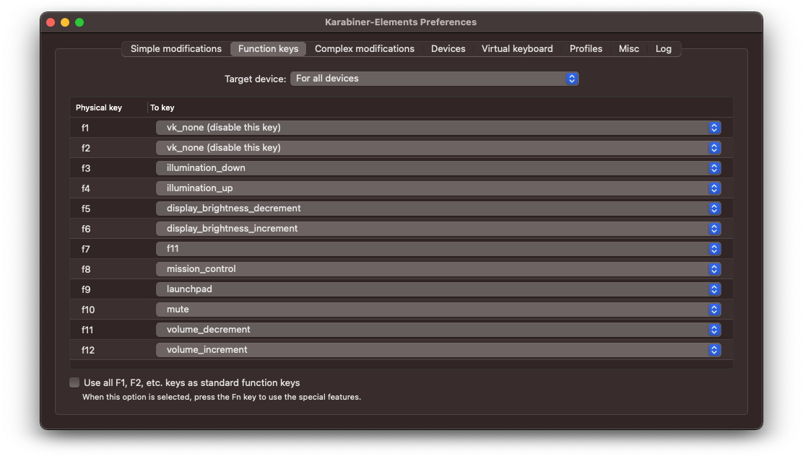

## ASUS UX32VD Hackintosh

Guide on how to install macOS Big Sur on ASUS UX32VD Laptop


### Info

This Hackintosh was build with help of [danieleds/Asus-UX32VD-Hackintosh](https://github.com/danieleds/Asus-UX32VD-Hackintosh) repository as base.

Considerations for this project are moving towards a migration with OpenCore. Due to the effort for the migration, the current setup still uses Clover (with OC integration).

- macOS version: 11.1
- clover version: r5127

#### Laptop Frequent Questions: [tonymacx86.com](https://www.tonymacx86.com/threads/faq-read-first-laptop-frequent-questions.164990/)

---

#### BIOS

- Use version 214 (get ROM from [BIOS](/BIOS) folder)
- Check for correct BIOS settings:

  ```sh
  Basic
  - Intel Virtualization Technology [Enabled]
  - Intel AES-NI [Enabled]
  - VT-d [Enabled]

  SATA
  - SATA Mode Selection [AHCI]

  Graphics
  - DVMT Pre-Allocated [64M]

  Intel
  - Intel(R) Anti-Theft Technology [Enabled]

  USB
  - Legacy USB Support [Enabled]
  - XHCI Pre-Boot Mode [Auto]

  Network
  - Network Stack [Disabled]
  ```

#### Restrictions

The following features are not working or disabled:

- NVIDIA GeForce GT 620M
- Right/top USB-Connector
- F2 LED-Indicator

#### Hardware

This Hackintosh is based on an [ASUS UX32VD-R4002V](https://www.asus.com/de/supportonly/UX32VD/HelpDesk_Download/) Laptop, with an [Intel Core i7-3517U](https://ark.intel.com/content/www/de/de/ark/products/65714/intel-core-i7-3517u-processor-4m-cache-up-to-3-00-ghz.html) Processor and a [NVIDIA GeForce GT 620M](https://www.geforce.co.uk/hardware/notebook-gpus/geforce-gt-620m/specifications) graphics card.

##### RAM

The default 2GB of RAM were replaced with an equivalent [8GB DDR3](https://www.speicher.de/arbeitsspeicher-8gb-ddr3-asus-zenbook-ux32vd-r4002v-ram-so-dimm-sp247073.html) module to get 10GB of RAM.

##### Graphics

The NVIDIA GeForce GT 620M was disabled in favour of the Ivy Bridge Intel HD 4000 graphics card which is renamed to iGPU with a DSDT patch.

##### WIFI / Bluetooth

As the default WiFi/BT card is not supported by macOS, it is replaced by a [Broadcom BCM4352 Combo card](https://osxlatitude.com/forums/topic/2767-broadcom-bcm4352-80211-ac-wifi-and-bluetooth-combo-card/).
<br>Notice that antenna-adapters are needed when replacing the default card due to different connector sizes ([link](http://forum.notebookreview.com/threads/upgrading-asus-ux32vd-wireless-card-antenna-connector-problem-help.731735/)).

##### Ethernet

The default USB-ethernet adapter was replaced with a [UGREEN 20256 Adapter](https://www.ugreen.com/product/UGREEN_Network_Adapter_USB_to_Ethernet_RJ45_Lan_Gigabit_Adapter_for_Ethernet_Black-en.html) after it stopped working.
Benefits of the new adapter are USB3 and Gigabit speed.

---

### Install macOS

#### 1. Create Clover Drive

##### a) Preparation

- Format USB-Drive with GUID and APFS ([Link](https://www.howtogeek.com/272741/how-to-format-a-drive-with-the-apfs-file-system-on-macos-sierra/))

  - Find the correct disk number of USB-Drive:

        diskutil list

  - Replace {#} with corresponding disk number and {Volume} with desired Name:

        diskutil apfs createContainer /dev/disk{#}
        diskutil apfs addVolume disk{#} APFS {Volume}

- Download latest Clover release: [github.com/CloverHackyColor](https://github.com/CloverHackyColor/CloverBootloader/releases)

##### b) Install Clover

- Follow these steps:
  
  
  
  

##### c) Post Install

- Overwrite `CsmVideoDxe.efi` from/to `EFI/CLOVER/drivers/UEFI/`
- Copy all ACPI patches from/to `EFI/CLOVER/ACPI/patched/`
- Rename `config.plist` to `config-org.plist` in `EFI/CLOVER`
- Copy `config.plist` from/to `EFI/CLOVER/config.plist`
- Copy all kexts from/to `EFI/CLOVER/kexts/Other/`
  - Delete all 10.X folders in `EFI/CLOVER/kexts/`
- (Optional: Copy favorite Clover theme to `EFI/CLOVER/themes`)

#### 2. Create macOS Installer Drive

To create a working macOS Installer boot drive, you will need the following:

- An empty USB3 flash drive (minimum 32GB)
- A device already running macOS with App Store access

##### a) Download macOS Installer

- Open the Mac App Store on a device running macOS
- Download `Install macOS Big Sur` application
- Close Installer when it opens automatically

##### b) Create Installer Stick

- Follow this guide: [macOS Big Sur 11: bootbaren USB-Stick erstellen](https://www.zdnet.de/88389660/macos-big-sur-11-bootbaren-usb-stick-erstellen/)
  
  Create installer stick with this command:

  ```sh
  sudo /Applications/Install\ macOS\ Big\ Sur.app/Contents/Resources/createinstallmedia --volume /Volumes/Big\ Sur/ --nointeraction
  ```

##### c) Patch Installer Stick

Enable installation on unsupported hardware:
  
- Download and unpack: [barrykn/big-sur-micropatcher](https://github.com/barrykn/big-sur-micropatcher/releases)
- Execute in Terminal
  
  ```sh
  ~/Downloads/big-sur-micropatcher-main/micropatcher.sh
  ```

---

#### 3. Install macOS

- Connect macOS Installer and Clover Drive to your UX32VD

##### Stage 0

- Boot from Clover drive and select macOS Installer (`Install macOS Big Sur`)
- Disable all Broadcom kexts:
  - Hit Spacebar after selecting macOS Installer
  - Select `Block injected kexts ->` (Spacebar)
  - Select `Other ->` (Spacebar)
  - Select (Spacebar)
    - `AirportBrcmFixup.kext`
    - `BrcmBluetoothInjector.kext`
    - `BrcmFirmwareData.kext`
    - `BrcmPatchRAM3.kext`
  - Select `Return` twice (Spacebar)
  - Select `Boot macOS with selected options`
- If screen turns completely blue, reboot

##### Stage 1

- Once installer shows up, follow the installation instructions

##### Stage 2

- On 1. reboot select `macOS HD` instead of `macOS Installer`
- Again disable all Broadcom kexts

##### Stage 3

- On 2. reboot [press F3](https://tiebac.baidu.com/p/7115539134) in Clover and select `Big Sur Preboot` Volume
- Repeat this step on 3. and 4. reboot

##### Stage 4

- Once installation is complete, create user account and finish setup process
- From now on boot regular `Big Sur` Volume from `macOS HD`

---

#### 4. Post Installation

##### a) Install Clover in EFI partition of macOS HD

- After successfully install repeat steps 1b - 1c but with EFI on macOS HD as target
- Follow this guide to add clover boot entry in BIOS [Restoring UEFI boot entry](https://www.thomas-krenn.com/en/wiki/Restoring_UEFI_boot_entry_via_motherboard_replacement_or_BIOS_update) or this [UEFI clover boot option](https://www.tonymacx86.com/threads/solved-uefi-clover-boot-option-gone-after-bios-update.211715/#post-1409404)

##### b) Install AsusSMCDaemon

- Unzip `Post-Install/AsusSMCDaemon.zip`
- Run `install_daemon.sh` as root [Link](https://github.com/hieplpvip/AsusSMC/wiki/Installation-Instruction#2-installing-asussmcdaemon-only-if-you-have-sleep-and-airplane-fn-keys)

##### c) Install Karabiner Elements

- Install Karabiner Elements from `Post-Install/Karabiner-Elements-13.1.0.dmg`
- Create configuration with following options:

  
  

##### d) Optimize Clover GUI

- Unzip and install Clover Configurator from `Post-Install/CCG 5.17.3.0.zip`
- Mount EFI partition, load `config.plist` go to `GUI` section and modify custom boot entries to match your setup

---

### Troubleshooting

- If display shows graphical glitches, close lid, wait for sleep and reopen

- ~~When getting `Error loading kernel cache` reboot until it passes~~  
  (should be fixed with OpenRuntime.efi)

- ~~On `USBSMC Error` check if your Installer-Drive is USB3, use an USB2 Drive (or cable/adapter) instead~~ (not more valid for Big Sur)

- If EFI partition is messed up and boot only works in safe mode, mount EFI with:

  ```sh
  sudo mkdir /kexts
  sudo cp -RX /System/Library/Extensions/msdosfs.kext /kexts
  sudo /usr/libexec/PlistBuddy -c "Add :OSBundleRequired string" /kexts/msdosfs.kext/Contents/Info.plist
  sudo /usr/libexec/PlistBuddy -c "Set :OSBundleRequired \"Safe Boot\"" /kexts/msdosfs.kext/Contents/Info.plist
  ```

---

### Update Clover

Update with Clover Configurator or download latest `CLOVERX64.efi` from [github.com/CloverHackyColor](https://github.com/CloverHackyColor/CloverBootloader/releases) and replace in `EFI/CLOVER/CLOVERX64.efi` and `EFI/BOOT/BOOTX64.efi`

### Update macOS

- Make a full backup
- Check [hackintosher.com](https://hackintosher.com/guides/) for the latest macOS Update Guide
- Check all kexts for updates
- Create a new Clover Drive for testing purpose
  - Use updated kexts and drivers in post install
- Boot from new Clover Drive
- If system boots
  - Mount EFI partition of macOS HD
  - Backup `EFI` to `EFI-Backups`
  - Install new Clover version to EFI partition
  - Copy updated kexts and drivers during post install
  - Don't forget to copy `Microsoft` and `Ubuntu` folder (it contains the windows and ubuntu bootloader)
- Eject Clover Drive and reboot
- If system boots
  - Start macOS Update
  - On restart select newly added `Install macOS Big Sur` partition
  - After reboot select normal macOS HD partition
- If system boots
  - Be happy and enjoy the new update
- If system doesn't boot on one of these steps
  - Try to fix the problem or revert to the latest backup

---

## Resources

### Sleep

- In order to get sleep working with Bluetooth enabled the [GPRW-Patch](https://dortania.github.io/USB-Map-Guide/misc/instant-wake.html) is applied. ~~Loading of SSDT-GPRW.aml fails, but it seems that the `Rename GPRW to XPRW` ACPI-patch is sufficient, as it prevents waking up from sleep (but producing some error logs in verbose boot).~~

---

### ACPI

- SSDT-EC.aml fixes embedded controller (since macOS Catalina)
- SSDT-GPRW.aml prevents instant wake from sleep (usb-devices)
- SSDT-PNLF.aml activates display backlight control

### SSDT

#### Method 1: use precompiled SSDT

🚨 WARNING: Make sure you have exactly the same CPU (Core i7-3517U) 🚨  
Use precompiled SSDT from `SSDT/SSDT.aml` and copy to `EFI/CLOVER/ACPI/patched/`

#### Method 2: create your own SSDT

Generate your own SSDT with [ssdtPRGen.sh](https://github.com/Piker-Alpha/ssdtPRGen.sh)  
-x 1 is for Ivy Bridge CPU  
-lmf 900 sets lowest idle frequency to 900 mhz

    ./ssdtPRGen.sh -x 1 -lfm 900

Copy `/Users/{Name}/Library/ssdtPRGen/ssdt.aml` to `EFI/CLOVER/ACPI/patched/`  
Replace existing file, rename it to `SSDT.aml`

### DSDT

#### Method 1: use precompiled DSDT

🚨 WARNING: Make sure you have exactly the same Laptop Model (UX32VD-R4002V) 🚨  
Use precompiled DSDT from `DSDT/DSDT.aml` and copy to `EFI/CLOVER/ACPI/patched/`

#### Method 2: create your own DSDT

Generation of DSDT is inspired by: [danieleds/Asus-UX32VD-Hackintosh](https://github.com/danieleds/Asus-UX32VD-Hackintosh/tree/master/src/DSDT)

- Extract original ACPI by pressing F4 in Clover menu
- Download [acidanthera/MaciASL](https://github.com/acidanthera/MaciASL/releases)
  - Set iASL Compiler to `Legacy` in Preferences
- Open `EFI/CLOVER/ACPI/origin/DSDT.aml` with MaciASL
- Apply all patches from `DSDT/patches` in correct order
- Export `DSDT.aml` and copy to `EFI/CLOVER/ACPI/patched/`

---

### Clover Configuration

- Use `MacBookAir5.2` as SMBIOS

#### Fix for Hibernation

- Hackintool -> Power -> Fix Sleep  
  (Sets Clover -> ACPI -> FixMCFG)

#### Fix Freeze after Wakeup

- Setting up the iGPU [Link](https://khronokernel-4.gitbook.io/disable-unsupported-gpus/igpu)
- Disable GPU with Boot Flags [Link](https://khronokernel-4.gitbook.io/disable-unsupported-gpus/disabling-the-gpu/option-1-boot-flags)

#### Enable TRIM for SSD

There are two options:

- Run following command in the terminal:

  `sudo trimforce enable`

- Patch kext with clover configurator:

  ```sh
  com.apple.iokit.IOAHCIBlockStorage

  00415050 4C452053 534400
  00000000 00000000 000000
  ```

#### Fix OC boot for Big Sur ([Link](https://www.reddit.com/r/hackintosh/comments/fu8f8w/getting_crazy_with_10154_boot_error/))

- Change Quirk `SetupVirtualMap` to `True`


#### Fix WiFi for Big Sur ([Link](https://www.tonymacx86.com/threads/help-bcm94352z-bluetooth-works-wifi-dont-on-big-sur.305843/page-3#post-2211335))

- Remove `AirPortBrcm4360_Injector.kext` from plugins folder of `AirportBRCMFixup.kext` (right click -> package content)

- Add in `config.plist` -> `KernelAndKextPatches` -> `KextsToPatch`
  
  ```plist
  <dict>
      <key>Arch</key>
      <string>Any</string>
      <key>BundlePath</key>
      <string>AirportBrcmFixup.kext/Contents/PlugIns/AirPortBrcmNIC_Injector.kext</string>
      <key>Comment</key>
      <string></string>
      <key>Enabled</key>
      <true/>
      <key>ExecutablePath</key>
      <string></string>
      <key>MaxKernel</key>
      <string></string>
      <key>MinKernel</key>
      <string></string>
      <key>PlistPath</key>
      <string>Contents/Info.plist</string>
  </dict>
  ```

---

### Kexts

#### Kext Patch: [acidanthera/Lilu](https://github.com/acidanthera/Lilu/releases)

- Lilu.kext

#### Graphics: [acidanthera/WhateverGreen](https://github.com/acidanthera/WhateverGreen)

- WhateverGreen.kext

#### WiFi: [acidanthera/AirportBrcmFixup](https://github.com/acidanthera/AirportBrcmFixup/releases)

- AirportBrcmFixup.kext

#### Bluetooth: [acidanthera/BrcmPatchRAM](https://github.com/acidanthera/BrcmPatchRAM/releases)

- BrcmBluetoothInjector.kext
- BrcmFirmwareData.kext
- BrcmPatchRAM3.kext

#### Sensors: [acidanthera/VirtualSMC](https://github.com/acidanthera/VirtualSMC)

- VirtualSMC.kext
- SMCBatteryManager.kext
- SMCLightSensor.kext
- SMCProcessor.kext
- SMCSuperIO.kext

#### CPU: [tonymacx86/NullCPUPowerManagement](https://www.tonymacx86.com/resources/nullcpupowermanagement.268/)

- NullCPUPowerManagement.kext

#### Audio: AppleALC or VoodooHDA

- AppleALC.kext [acidanthera/AppleALC](https://github.com/acidanthera/AppleALC/releases/)
- VoodooHDA.kext [SourceForge/VoodooHDA](https://sourceforge.net/projects/voodoohda/)

#### TouchPad: [BAndysc/VoodooPS2](https://github.com/BAndysc/VoodooPS2)

- VoodooPS2Controller.kext

#### FN-Keys: [hieplpvip/AsusSMC](https://github.com/hieplpvip/AsusSMC)

- AsusSMC.kext

#### USB: [RehabMan/OS-X-Fake-PCI-ID](https://bitbucket.org/RehabMan/os-x-fake-pci-id/downloads/)

- FakePCIID.kext
- FakePCIID_XHCIMux.kext

---

### Driver

- ASIX USB 2.0 to 10/100M Fast Ethernet Controller [AX88772B Driver](https://www.asix.com.tw/download.php?PItemID=105&sub=driverdetail)

- Ugreen USB 3.0 Gigabit Ethernet Adapter [AX88179 Driver](https://www.ugreen.com/drivers/217-en.html)

---

### Tools

- [Clover Configurator](http://mackie100projects.altervista.org/download-clover-configurator/)
- [Hackintool](https://github.com/headkaze/Hackintool/releases/)

### Links

- [Clover Bootargs](https://www.hackintosh-forum.de/forum/thread/21723-clover-configurator-parameter-reiter-wiki-erkl%C3%A4rung/)
- [Hibernation Modes](https://www.tonymacx86.com/threads/what-is-different-between-hibernatemode-0-and-hibernatemode-3.164030/)